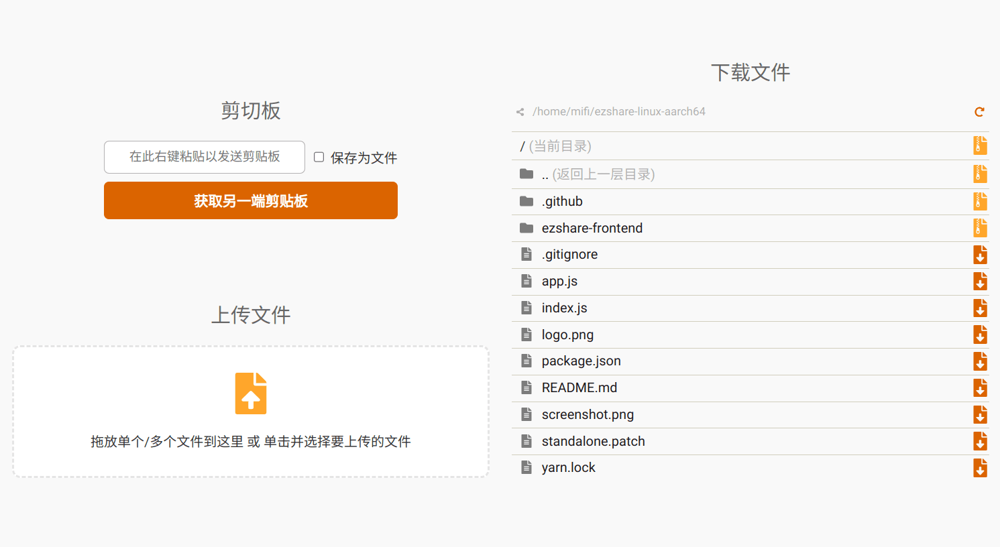

forked from **[mifi/ezshare](https://github.com/mifi/ezshare)**

## 改动
aarch64版：汉化了分享页面，去除了clipboard，因为clipboard(x86-64)在arm64平台不工作。

x86-64版：组件与原版保持一致，仅汉化和略微的页面改动。


一个简单的**文件服务器**，可以让您通过本地网络与朋友（或设备之间）轻松共享许多大文件，如照片和视频，而无需互联网连接。它启动一个 HTTP 服务器，在启动目录中列出所有文件和目录。然后，任何人都可以连接到服务器并下载文件或整个目录的自动生成的 ZIP 文件（类似于 Google Drive）。客户端还可以通过浏览器将文件上传到服务器，并且剪贴板可以双向共享。方便生成二维码。



## 特点
- 本地双向传输，无需通过互联网
- 无需快速互联网连接即可向他人发送高质量照片和视频
- 处理大文件和目录
- 处理大量文件
- 实时自动压缩目录
- 剪贴板双向共享(arm64版无此功能)
- Web客户端适用于所有主要平台，包括iOS和Android（服务器在Mac/Windows/Linux计算机上等运行）

## 使用方法
- 下载并解压独立执行文件:
- 添加执行权限、创建符号链接 (symbolic link)，将 ezshare 等可执行文件添加到系统的可执行文件路径中，使其在任何位置都可以被访问和执行。
```
chmod +x /你的路径/ezshare/*
ln -sT /绝对路径/ezshare/ezshare /usr/bin/ezshare
ln -sT /绝对路径/ezshare/clipboard /usr/bin/clipboard （arm64没有clipboard，无需执行这一行）
```
- 打开终端并运行以下命令：
```
cd /要分享的路径 && ezshare
或
ezshare /要分享的路径 如： ezshare Download , ezshare ~/Download
```
- 在另一端扫描二维码或打开浏览器并访问显示的 URL
- 开始上传文件或下载文件！
- **注意** 两台设备需要连接在同一个局域网（或个人热点）。

这是独立执行文件版，或者您也可以安装 Node.js nmp 后安装 ezshare：npm install -g ezshare，运行 ezshare：ezshare

要获取更多信息，请运行 ezshare --help。
